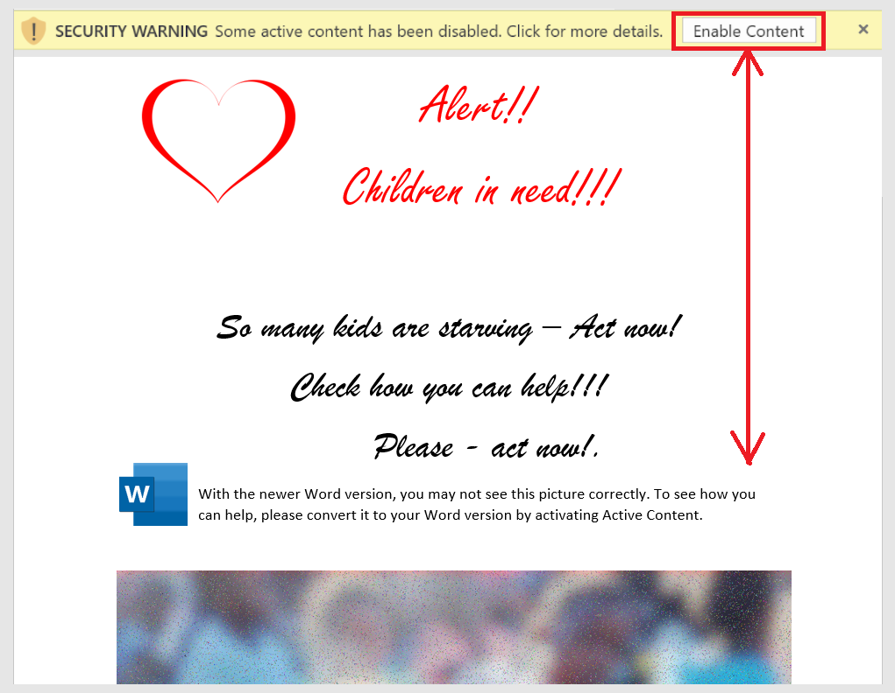

# ransomware

This repository is to explain the nature of malware and ransomware using MS Word document with macro. I spoke with many non-IT people aware that opening every received document from an unknown source is "forbidden." At the same time, almost no one knew why and what could be so dangerous with a simple MS Word document. That's why I decided to show some safe examples, which can be used to understand what can be done with a simple Word document.

You can find the article for this repo here - https://rafal-wawrzyniak.medium.com/ms-word-ransomware-understand-the-risks-of-macros-examples-4a6711eddb2a

Long story short - if you see a document like the one below - for sure, don't enable active content!!

